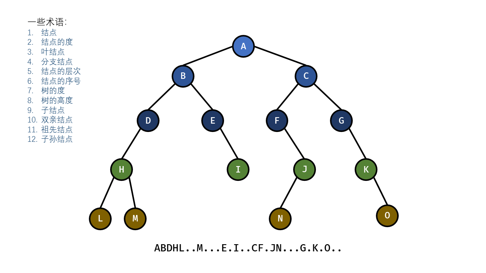

# 一级
## 二级
### 三级
#### 四级
##### 五级
###### 六级

正文直接输入，换行

实际空一行

```C
printf("记录。")；
```

正文中的代码通过 ``show up`` 直接框出

有序列表
1. 123
2. 456
3. 789
   1. 123
      1. 按tab键
         1. 分级

无序列表，输入 - ,然后空格
- 123
  - 456
    - 789
  
**加粗**
*倾斜*
***加粗和倾斜***

> 引用一段文字

- [ ] 待办事项
- [x] 已办事项


--- 
分割线

|标题1|标题2|标题3|
|-----|----|-----|
|内容1|内容2<br/>换行|内容3|
|内容4|内容5|内容6|

使用冒号来进行左对齐，居中和右对齐。左对齐的话，将冒号放在横线的左边，居中的话，将冒号放在横线的两端，右对齐的话，将冒号放在横线的右端。

|标题1|标题2|标题3|
|:----|:---:|---:|
|test左对齐|内容2|test右对齐|
|内容4|test居中|内容6|

[djs.png](./../DS/chap07-graph/djs.png)

[github](https://github.com/)

[链接到其他标题](#三级)



当我们需要强调一个符号或者一个函数的时候，可以在符号或者函数的两端使用`。

`强调 函数`

~~在文字上添加删除线~~

希腊字母

|名称|大写|code|小写|code|
|:---:|:---:|:---:|:---:|:---:|
|alpha|A|A|α|\alpha|
|beta|B|B|β|\beta|
|gamma|Γ|\Gamma|γ|\gamma|
|delta|	Δ	|\Delta|	δ|	\delta|
|epsilon	|E	|E|	ϵ|	\epsilon|
|zeta|	Z|	Z|	ζ|	\zeta|
|eta|	H	|H|	η|	\eta|
|theta|	Θ|	\Theta|	θ|	\theta|
|iota|	I|	I|	ι|	\iota|
|kappa|	K|	K|	κ|	\kappa|
|lambda|	Λ|	\Lambda|	λ|	\lambda|
|mu|	M|	M|	μ|	\mu|
|nu|	N|	N	|ν|	\nu|
|xi|	Ξ|	\Xi|	ξ|	\xi|
|omicron|	O|	O|	ο|	\omicron|
|pi|	Π|	\Pi|	π|	\pi|
|rho|	P|	P|	ρ|	\rho|
|sigma|	Σ	|\Sigma|	σ|	\sigma|
|tau|	T|	T|	τ|	\tau|
|upsilon|	Υ|Υ|	υ|	\upsilon|
|phi|	Φ	|\Phi|	ϕ|	\phi|
|chi|	X	|X|	χ|	\chi|
|psi|	Ψ	|\Psi|	ψ|	\psi|
|omega|	Ω|	\Omega	|ω	|\omega|

